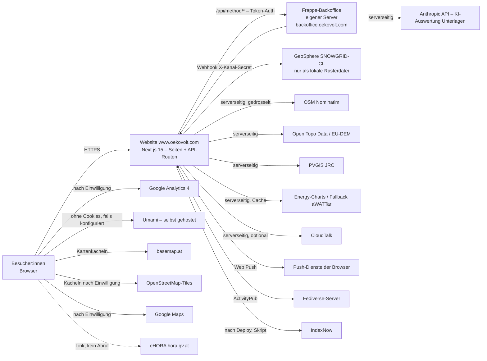
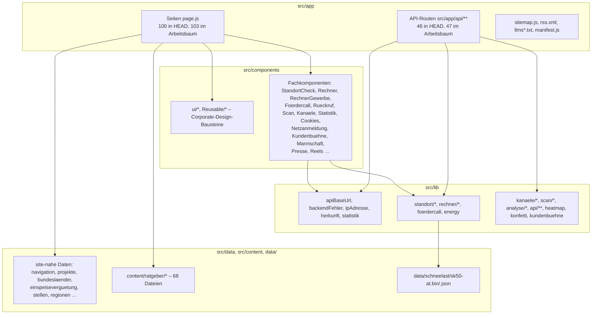
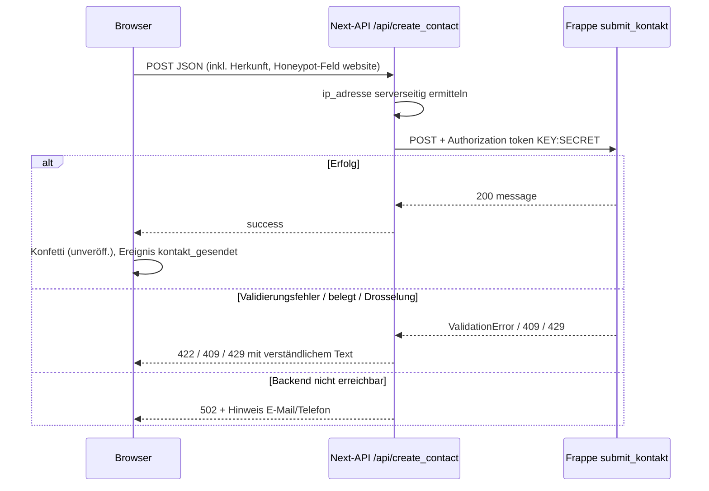
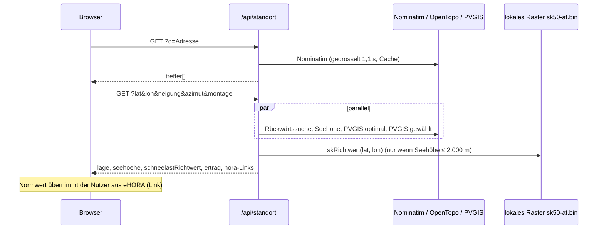
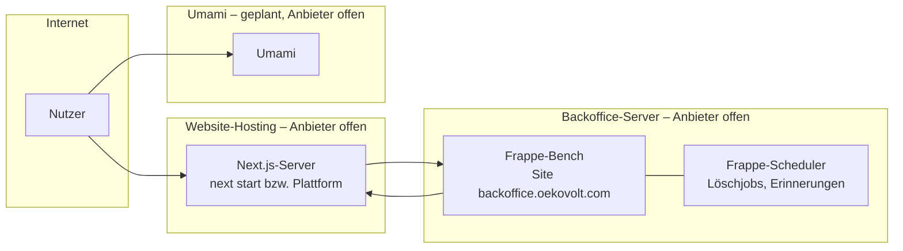

# 02 – Architekturbeschreibung

Gliederung in Anlehnung an ISO/IEC/IEEE 42010 (Stakeholder und Belange, Sichten, Architekturentscheidungen).
Keine Normkonformität behauptet. Stand: Version 0.3, 30.09.2026 (Nachführung Welle 3).

## 1. Stakeholder-Belange (Auszug)

| Belang | Stakeholder (siehe 01) | Behandelt in |
|---|---|---|
| Website funktioniert auch ohne/bei Ausfall des Backoffice | STK-01, STK-04 | Laufzeitsicht, ADR-003, ADR-014 |
| Secrets nur serverseitig | STK-08 | Bausteinsicht (BFF), 05 |
| Nutzungsbedingungen externer Datenquellen | STK-11 | ADR-002, ADR-007, 04 |
| Einwilligungspflichten TKG/DSGVO | STK-08 | ADR-004 |
| Paralleles Arbeiten mehrerer Agenten ohne `.next`-Konflikt | Entwicklung | ADR-009 |

## 2. Systemkontext

| Externer Partner | Richtung | Beleg |
|---|---|---|
| Frappe-Backoffice (AT) | Website → Frappe (Token), Frappe → Website (Webhook) | `src/lib/apiBaseUrl.js:4-19`, `src/app/api/kanaele/verteilen/route.js:19-21` |
| GeoSphere Austria (SNOWGRID-CL) | keine Laufzeitverbindung; Daten als Datei im Repo | `data/schneelast/sk50-at.json`, `src/lib/standort/schneelastRaster.js:7-18` |
| PVGIS (JRC) | Server → PVGIS | `src/lib/standort/dienste.js:14-17` |
| Nominatim (OSM) | Server → Nominatim | `src/lib/standort/dienste.js:6-9`, `src/lib/referenzOrte.js:16` |
| Open Topo Data (EU-DEM) | Server → Open Topo Data | `src/lib/standort/dienste.js:10-13` |
| Energy-Charts (Fraunhofer ISE), aWATTar | Server → Dienste | `src/lib/energy.js:3-9` |
| CloudTalk | Server → CloudTalk | `src/lib/rueckrufApi.js:21-27` |
| Umami (selbst gehostet) | Browser → Umami | `src/components/Statistik/Umami.js:3-17` |
| Google Analytics 4 | Browser → Google (nur nach Einwilligung) | `src/components/Statistik/GoogleAnalytics.js:57-115` |
| Anthropic | Frappe → Anthropic (nicht die Website) | `Import-Frappe/oekovoltdeutchland/oekovoltdeutchland/doctype/solar_lead/ki.py:7-9,97-123` |
| basemap.at | Browser → basemap.at (Standort-Check-Karte) | `src/components/StandortCheck/Karte.js:8-11` |
| OSM-Tiles | Browser → tile.openstreetmap.org (Referenzkarte, nach Einwilligung in der Karte) | `src/components/Referenzkarte/LeafletKarte.js:51-52`, `src/components/Referenzkarte/map.js:61-110` |
| EPEX Spot | **kein direkter Abruf**; Day-Ahead-Preise über Energy-Charts | `src/lib/energy.js:3-9` |
| IndexNow | Skript → api.indexnow.org | `scripts/indexnow.mjs:29` |
| Kunden-Websites | fremde Seiten binden das Solar-Siegel als Bild ein (`/siegel/<slug>.svg`), kein Rückkanal | `src/app/siegel/[slug]/route.js:1-7` |

**Offen:** Hosting der Website (Kommentare nennen sowohl „Vercel“ – `src/lib/rueckrufApi.js:10` – als auch
einen Produktionsserver mit `next start` – `next.config.mjs:3-6`); Hosting des Frappe-Servers; Hosting Umami.

## 3. Bausteinsicht

| Baustein | Verantwortung | Belege |
|---|---|---|
| `src/app/**/page.js` | Server-Komponenten mit `metadata`; 100 Seiten-Dateien in HEAD (103 im Arbeitsbaum inkl. Netzanmeldung) (dynamische Routen erzeugen mehr URLs; Sitemap 199 URLs laut `docs/AT-UEBERGABE.md:3`) | `find src/app -name page.js` |
| `src/app/api/**` | Backend-for-Frontend: Validierung, Drosselung, Weiterleitung an Frappe/externe Dienste; Secrets bleiben auf dem Server | siehe 03 |
| `src/middleware.js` | 410 Gone für WordPress-Artefakte | `src/middleware.js:1-58` |
| `src/components/ui`, `Reusable` | gemeinsame Gestaltungsbausteine (nicht ohne Auftrag ändern) | `docs/AT-BRIEFING.md:3-8,94-99` |
| `src/lib/site.js` | zentrale Firmendaten (FN, UID, GISA, Gesellschafter) | `docs/AT-BRIEFING.md:24-28` |
| `src/lib/rechner/*` | reine Rechenfunktionen der Rechner | `docs/AT-UEBERGABE.md:40` |
| `src/lib/standort/*` | externe Dienste, HORA-Links, Schneelast-Raster, Berechnung | `src/lib/standort/` |
| `src/data/*`, `src/content/*` | statische Inhalte und Rückfalldaten | 04 |
| `data/schneelast/*` | binäres Richtwertraster (per `outputFileTracingIncludes` ausgeliefert) | `next.config.mjs:14-15` |
| `public/*` | statische Assets, `robots.txt`, IndexNow-Schlüsseldatei, Service Worker `sw.js`, Tesseract-Dateien | `public/` |
| `scripts/*` | Generatoren und Tests (Node) | 06, 07 |
| `Import-Frappe/` | Frappe-Pakete (DE-Stand, App `oekovoltdeutchland`) | `Import-Frappe/ANLEITUNG.md` |
| `Import-Backend-Frappe/` | AT-Backend-Paket (laut Auftraggeber vollständig, nicht committet): App `oekovolt_app` (Projekte inkl. Kundenfelder, Referenzkarte, Kontakt, Angebot, Solarrechner, Termine) und App `oekovoltdeutchland` (Produktseiten, Hersteller, Heatmap, Solar Lead, Kanäle, Hinweis, Rückruf u. a., AT-angepasst); `installation/` mit Skripten und Vorlagen | `Import-Backend-Frappe/README.md`, `apps/*/README.md` |
| `src/components/Kundenbuehne`, `src/lib/kundenbuehne*.js`, `src/data/kunden.js` | Kundenporträt, Solar-Siegel, Social-Kit, ESG-Kurzbericht | 01 REQ-REF-05/06 |
| `src/components/Netzanmeldung`, `src/data/netzbetreiber.js` | Netzanmeldung je Netzbetreiber | 01 REQ-NETZ-* |
| `src/data/kennzahlen.js` | zentrale Unternehmenskennzahlen (teilweise noch als Text dupliziert, siehe REQ-UNT-01) | 01 REQ-UNT-01 |
| `src/data/reels.js`, `src/components/Reels`, `src/app/mediathek`, `scripts/reels-optimieren.mjs` | selbst gehostete Mediathek | 01 REQ-MED-* |
| `src/data/mannschaft.js`, `src/components/Mannschaft` | Mannschaft & Maschinenpark (Freigabe-Flag je Eintrag) | 01 REQ-UNT-02 |
| `src/data/hinweisgeber.js` | zentraler Schalter `HINWEIS_INTERN` für Meldekanal, Texte, Redirects | 01 REQ-HIN-01 |

## 4. Laufzeitsicht (ausgewählte Abläufe)

### 4.1 Anfrage (Beispiel Kontakt / Service)

Belege: `src/app/api/create_contact/route.js:14-50`, `src/lib/backendFehler.js:7-15`, `src/components/Kontakt/KontaktFormular.js:125-129`.

### 4.2 Standort-Check

Belege: `src/app/api/standort/route.js:53-139`.

### 4.3 Referenzen mit Rückfall

`ladeProjektListe()` fragt `get_projekte` ab (Cache 600 s). Nicht konfiguriert, HTTP-Fehler, Ausnahme oder
leere Liste → statischer Stand `src/data/projekte.js`. Ab einem API-Projekt gilt ausschließlich die API.
Belege: `src/components/Project/ladeProjekte.js:1-30`, Test `scripts/projekte-fallback.test.mjs`.

### 4.4 Kanäle / Push

Frappe ruft beim Veröffentlichen den Webhook `/api/kanaele/verteilen` (Header `X-Kanal-Secret`) auf; ein
Cron-Aufruf (`Authorization: Bearer CRON_SECRET`) dient als Sicherheitsnetz. Die Route versendet fällige
Push-Nachrichten und verteilt neue Beiträge an Fediverse-Follower.
Belege: `src/app/api/kanaele/verteilen/route.js:13-30`, `Import-Frappe/4_site_config.sh:8-9`.
Taktgeber: Das Backoffice ruft den Webhook zusätzlich alle 5 Minuten auf (`cron */5` → `veroeffentlichung.api.website_anstossen`, `Import-Backend-Frappe/apps/oekovoltdeutchland/README.md`, Abschnitt Hooks; `…/doctype/veroeffentlichung/api.py:38-46`). Damit werden geplante Push-Nachrichten (z. B. zum 08.10.) ohne externen Cron versendet, sofern Webhook-URL und Secret gesetzt sind. Ein zusätzlicher Cron mit `CRON_SECRET` bleibt optional.

## 5. Verteilungssicht

| Knoten | Belegter Sachverhalt | Offen |
|---|---|---|
| Website | Next.js 15, Node-Laufzeit für Routen mit `fs`/`crypto` (`export const runtime = "nodejs"`, z. B. `src/app/api/standort/route.js:24`); Domains oekovolt.com/.at → www.oekovolt.com (301) | Hosting-Anbieter, Region, Skalierung (In-Memory-Drosselung gilt je Instanz) |
| Backoffice | Host `backoffice.oekovolt.com` (Bilder über `/api/image`; `host_name` in `site_config.json`); Zeitzone Europe/Vienna laut `Import-Backend-Frappe/apps/oekovoltdeutchland/README.md` (Installation) | Server, Version Frappe, Backups; ob AT und DE ein gemeinsames Backoffice nutzen (`docs/AT-UEBERGABE.md:85`) |
| Umami | Beispiel-URL `statistik.oekovolt.com` im Kommentar (`src/components/Statistik/Umami.js:7`) | Instanz vorhanden? |

## 6. Architekturentscheidungen (ADR-Liste)

| ID | Entscheidung | Begründung / Alternativen | Beleg | Status |
|---|---|---|---|---|
| ADR-001 | Next.js App Router; API-Routen als Backend-for-Frontend vor dem Frappe-Backoffice | API-Schlüssel nur serverseitig; einheitliche Fehler-/Drosselungslogik | `src/lib/apiBaseUrl.js`, `src/lib/backendFehler.js` | gültig |
| ADR-002 | **Keine HORA-Abfrage**; eigener Schneelast-Richtwert aus GeoSphere SNOWGRID-CL (GEV/L-Momente, 50-jährlich, 1-km-Raster, EPSG:3416) als lokale Datei; eHORA-Normwert bleibt maßgeblich | HORA untersagt automatisierte Abrufe; Richtwert ohne externen Abruf; klar als Richtwert gekennzeichnet | `src/lib/standort/hora.js:10`, `src/lib/standort/schneelastRaster.js:1-22`, `data/schneelast/sk50-at.json` | gültig; Kalibrierung offen |
| ADR-003 | **Statischer Referenzen-Fallback** mit den 58 Live-Projekten; API führend | alte Projekt-URLs dürfen nicht ins Leere laufen, solange das AT-Backoffice nicht liefert | `src/data/projekte.js:1-12`, `src/components/Project/ladeProjekte.js:4-7` | gültig (Übergangslösung) |
| ADR-004 | **Cookielose Messung** (Umami, ohne Einwilligung) + **einwilligungspflichtige** Dienste (GA4 mit Consent Mode, Heatmap) | Grundmessung ohne Cookie-Banner-Abhängigkeit; Detailanalyse nur mit Einwilligung (§ 165 Abs. 3 TKG 2021) | `src/components/Statistik/Umami.js`, `src/components/Statistik/GoogleAnalytics.js`, `src/lib/heatmap.js` | gültig; Rechtsprüfung offen |
| ADR-005 | **Eigener Konfetti-Effekt ohne Bibliothek** (Canvas, dynamisch importiert) | keine neue Abhängigkeit (`docs/AT-BRIEFING.md:8`), volle Kontrolle über Barrierefreiheit | `src/lib/konfetti.js:1-7` | gültig (unveröff.) |
| ADR-006 | Hinweisgebersystem vorerst extern (IntegrityLine, 307); eigenes System hinter `HINWEIS_INTERN=1` (seit Welle 3 zentraler Build-Zeit-Schalter, ADR-022) | Freigabe des eigenen Systems ausstehend; 307 vermeidet Browser-Cache-Probleme | `next.config.mjs` (HEAD 30-34), `src/lib/hinweisApi.js:18-21` | gültig |
| ADR-007 | Externe Dienste nur serverseitig mit Drosselung, Cache und eigenem User-Agent; Open-Meteo bewusst nicht | Nutzungsbedingungen (Nominatim 1/s, Open Topo Data 1/s, 1.000/Tag); Open-Meteo nur nicht-kommerziell | `src/lib/standort/dienste.js:1-24,50-68` | gültig |
| ADR-008 | Kampagnen-Herkunft ohne Cookies/Browserspeicher, nur mit Anfrage übertragen | keine Einwilligung nötig für Zuordnung von Anfragen | `src/lib/herkunft.js:1-6` | gültig |
| ADR-009 | Build-Ausgabeverzeichnis über `NEXT_DIST_DIR` umschaltbar | `next dev`/`next build` im selben `.next` stören laufenden Server | `next.config.mjs:3-7` | gültig |
| ADR-010 | Zahlenformat einheitlich mit Punkt statt `Intl` `de-AT` | `de-AT` formatiert in Node und Browser unterschiedlich → Hydration-Warnungen | `docs/AT-UEBERGABE.md:45-46` | gültig |
| ADR-011 | OCR (Tesseract) vom eigenen Server, kein CDN | keine Datenübertragung an Dritte | `scripts/tesseract-assets.mjs:1-3` | gültig |
| ADR-012 | Strommarktdaten von Energy-Charts, Rückfall aWATTar; serverseitig gecacht | schlüsselfreie Quellen, Besucher treffen keine Drittanbieter | `src/lib/energy.js:1-20` | gültig; Datenlizenz Börsenpreise offen (R-12) |
| ADR-013 | Heatmap: Browser sammelt gerundete Positionen, Next-Route drosselt mit gesalzenem IP-Hash und leitet **ohne IP** an Frappe (`heatmap_zelle`) weiter; Ansicht nur mit `HEATMAP_TOKEN` | Datensparsamkeit, keine Rohdaten | `src/app/api/heatmap/route.js:1-60`, Spezifikation #15/#16 | gültig (unveröff.) |
| ADR-014 | Seiten mit Backoffice-Inhalt rendern ohne Backoffice zur Laufzeit statt 404 aus dem Build (z. B. Speicher-Partnerseiten) | Livegang vor Fertigstellung des AT-Backoffice | Commit `5e40806`, `src/app/produkte/stromspeicher/[slug]/page.js` | gültig |
| ADR-015 | Rechner-Logik als reine Funktionen in `src/lib/rechner/*` | Testbarkeit mit Node | `docs/AT-UEBERGABE.md:40` | gültig; Tests dazu nicht im Repo (siehe 06) |
| ADR-016 | Heatmap-Ansicht mit der Bibliothek `heatmap.js` | ausdrücklicher Wunsch des Auftraggebers (Ausnahme zur Regel „keine neuen Bibliotheken“; Konfetti bleibt ohne Bibliothek) | `src/components/Statistik/HeatmapAnsicht.js:3`, `package.json` | gültig (unveröff.) |
| ADR-017 | Kundenbühne: Backoffice-Felder am Projekt führend, statischer Rückfall `src/data/kunden.js`; Zitat/Logo nur nach Freigabe; Zahlen mit offengelegtem Rechenweg (1.050 kWh/kWp, 258,2 g CO₂/kWh) | Livegang ohne vollständiges Backoffice, nur belegte Angaben, UWG-Vorsicht | `src/lib/kundenbuehneServer.js:1-7`, `src/lib/kundenbuehne.js:1-25` | gültig (unveröff.); Freigaben offen |
| ADR-018 | Schutzschicht für alle Anfrage-Routen einheitlich (`gedrosselt`, `leseJson` aus `anfrageWeiterleiten.js`) plus Drosselung im Backoffice | Spam-/Lastschutz doppelt: Website je Instanz, Backoffice zentral je IP | `src/lib/api/uber-uns/anfrageWeiterleiten.js:102-150` | gültig (unveröff.) |
| ADR-019 | **Reels selbst hosten** statt Facebook-Einbettung | keine Verbindung zu Meta → keine Einwilligung, keine Drittanbieter-Cookies; Videos im eigenen `public/`-Ordner, Aufbereitung per ffmpeg-Skript | `src/data/reels.js:5-6` | gültig (unveröff.); Musikrechte offen |
| ADR-020 | **Kennzahlen aus einer Datei** mit Freigabe-Stand und neutraler CO₂-Beschriftung bis zur Klärung | UWG-Vorsicht, einheitliche Werte | `src/data/kennzahlen.js:1-21` | gültig; Duplikate im Text abbauen |
| ADR-021 | **Freigabe-Flag je Aussage** (`bestaetigt`) für Unternehmensangaben | nur bestätigte Fakten sichtbar, vorbereitete Kandidaten ohne Codeänderung freischaltbar | `src/data/mannschaft.js:24-28` | gültig |
| ADR-022 | **Hinweisgebersystem-Schalter zur Build-Zeit** (`HINWEIS_INTERN`) steuert Redirects, API, Texte, Sitemap und `llms.txt` gemeinsam | ein Schalter statt verstreuter Bedingungen; Wechsel erfordert neuen Build | `src/data/hinweisgeber.js:8`, `next.config.mjs:32-39`, `docs/frappe-hinweisgebersystem/GO-LIVE-AT.md` | gültig |
